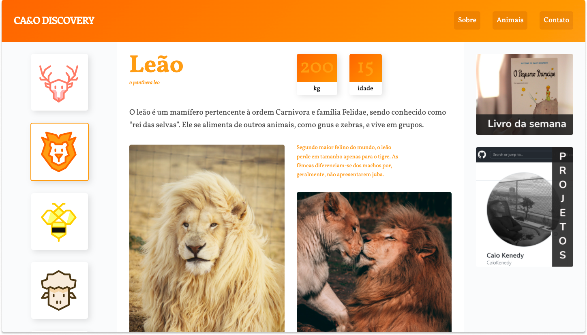

# CA&O-DISCOVERY



<p align="center">
  
</p>

> O CA&O Discovery é um projeto da empresa fictícia CA&O. Elaborado para ser uma espécie de "wikipedia" interativo, com seu público alvo sendo crianças, porém, atrativo para todos. A finalidade é promover conhecimento científico sobre animais, e trazer essas informações de forma simples e visualmente atrativa.

## 💻 Acessando o website
Você pode acessar o projeto [clicando aqui.](https://caiokenedy.github.io/Caio-Discovery/)


## 🔧 Tecnologias e ferramentas utilizadas
- HTML5
- CSS3
- Javascript (com o plugin [Simple Anime](https://github.com/origamid/simple-anime))


## 🔖 Ajustes e melhorias

- [x] Deixar o site totalmente responsivo
- [x] O site deverá ser compreensível através de leitores de tela
- [ ] Checagem minuciosa de algumas informações científicas
- [ ] Setar o tamanho fixo das imagens para tornar o loading mais rápido
- [ ] Adicionar novas páginas


## 🚀 executando o projeto

```bash
#### Clone o repositório
git clone https://github.com/CaioKenedy/Caio-Discovery

#### Entre no diretório
cd Caio-Discovery
```
Depois disso, utilize uma ferramenta como o [Live Server](https://marketplace.visualstudio.com/items?itemName=ritwickdey.LiveServer) para criar um servidor local e executar o projeto.


## 📫 Contribuindo para <Ca&o Discovery>

Para contribuir siga estas etapas:

1. Bifurque este repositório.
2. Crie um branch: `git checkout -b <nome_branch>`.
3. Faça suas alterações e confirme-as: `git commit -m '<mensagem_commit>'`
4. Envie para o branch original: `git push origin <nome_do_projeto> / <local>`
5. Crie a solicitação de pull.

Como alternativa, consulte a documentação do GitHub em [como criar uma solicitação pull](https://help.github.com/en/github/collaborating-with-issues-and-pull-requests/creating-a-pull-request).


### 📝 Licença

Esse projeto está sob licença. Veja o arquivo [LICENÇA](LICENSE.md) para mais detalhes.

[⬆ Voltar ao topo](#cao-discovery)<br>

